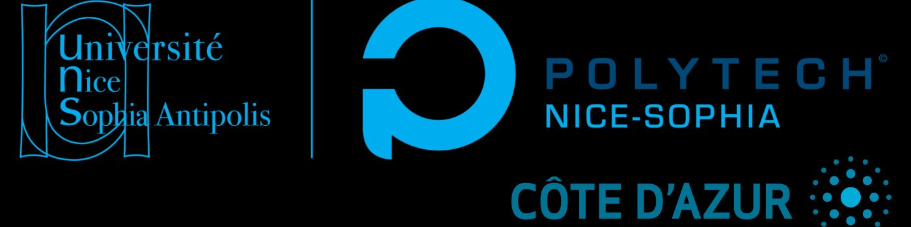

### Hi there 👋

My name is **Lidaou Denis ASSOTI** (LidaouDA)  
I am currently in the second year of the engineering cycle (Master 1) of **Computer Sciences** at **Polytech’ Nice Sophia Antipolis** Engineering School in France(Sophia Antipolis). 

<h2 align="left" id="denisassoti">😁 About me</h2>

- 🔭 I’m currently working on my portfolio (Coming soon)
- 🌱 I’m currently learning c# / .Net
- 👯 I’m looking to collaborate on ...
- 🤔 I’m looking for help with ...
- 💬 Ask me about ...
- 📫 How to reach me: ...
- 😄 Pronouns: Me
- ⚡ Fun fact: ...
-  

<!-- 
 -->

<h2 align="left" id="denisassoti">👨‍💻 My Favorite Techs & tools</h2>
<table align="center">
  <tr>
    <td align="center" width="96">
        
         Python
    </td>
    <td align="center" width="96">
      
       C#
    </td>
    <td align="center" width="96">
        
         .NET Core
    </td>
    <td align="center" width="96">
        
          Java
    </td>
    <td align="center" width="96">
        
          C++
    </td>
     <td align="center" width="96">
      
       Node JS
    </td>
    <td align="center" width="96">
      
       Vue JS
    </td>
    <td align="center" width="96">
      
       Angular
    </td>
  </tr>
  <tr>
    <td align="center" width="96">
        
         React JS
      </td>
   <td align="center" width="96">
      
       Git
    </td>
    <td align="center" width="96">
      
       Linux
    </td>
    <td align="center" width="96">
        
         Azure
    </td>
    <td align="center" width="96">
      
       Docker
    </td>
    <td align="center" width="96">
        
         Spring
    </td>
    <td align="center" width="96">
        
         Laravel
    </td>
    <td align="center" width="96">
      
       FastApi
    </td>
  </tr>
</table>

<h2 align="left" id="denisassoti">😎 My Social media & professional accounts</h2>

 
 

<h2 align="left" id="denisassoti">🤖 My Stats</h2>

 
 

